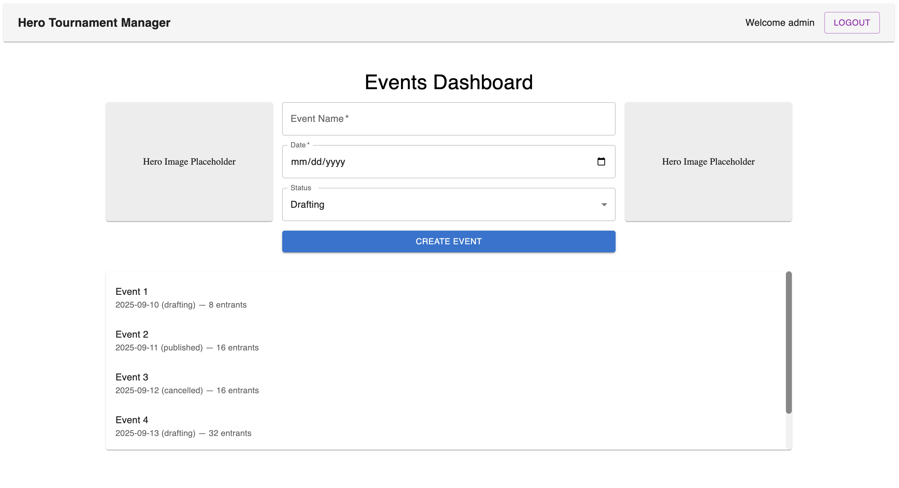
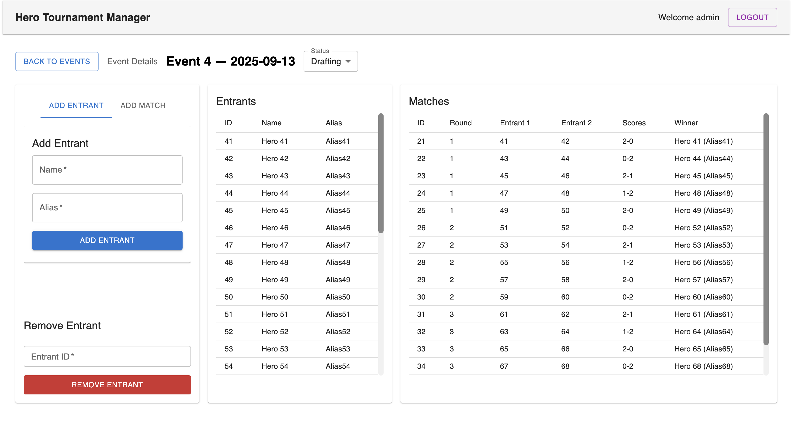
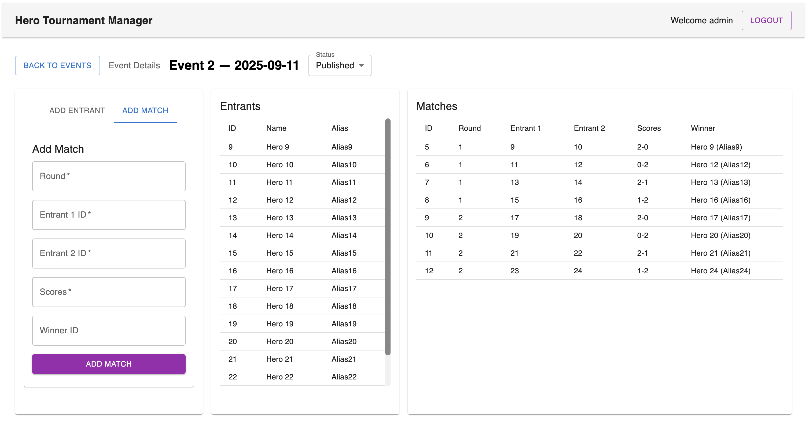
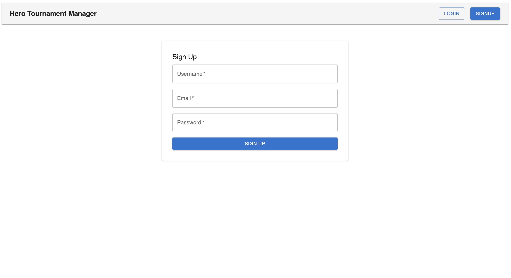
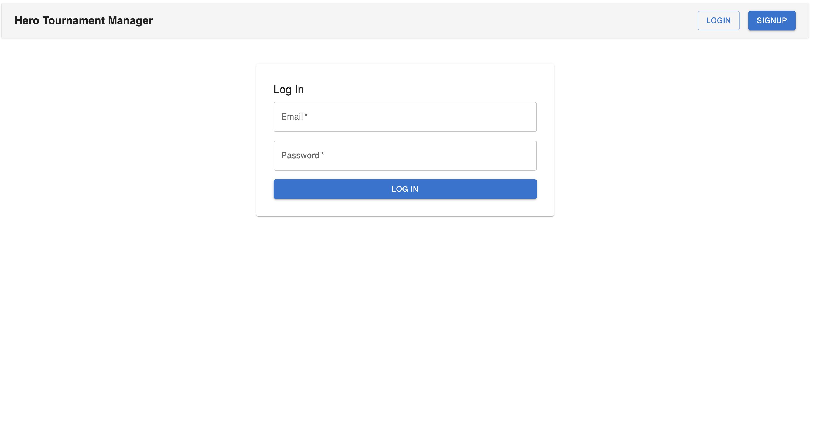

# Hero Tournament Manager
> Project 2 of Flatiron Capstone – Full-stack web application for managing hero/villain tournaments.

---

## Overview
Following [Hero vs Villain Showdown](https://github.com/nrathbone-turing/hero-vs-villain-rps-showdown) (Project 1, a frontend React app using the [SuperHero API](https://superheroapi.com/)), this project pivots into a full-stack productivity tool. Instead of one-off battles, the focus is on organizing tournaments: creating events, registering entrants, logging matches, and displaying standings.

This keeps the hero/villain theme while addressing a distinct problem: managing group play efficiently.

Technologies introduced:
- Flask + SQLAlchemy + SQLite/PostgreSQL backend
- Relational data models + migrations + seed scripts
- React frontend with CRUD integration + routing
- Authentication & protected routes
- Dynamic entrant counts & match winner resolution
- Scrollable + sortable UI components for long lists
- Backend-driven multi-level event sorting (date --> status --> name)
- Linting & formatting for both backend (flake8/black) and frontend (eslint/prettier)

---

## Features
- **Events**
  - Create, update, delete tournaments
  - Statuses: Drafting, Published, Cancelled, Completed
  - Sorted by date (newest --> oldest), then status priority, then name
- **Entrants**
  - Register with name + alias
  - Remove entrants dynamically
  - Entrant counts shown on the dashboard
- **Matches**
  - Log results with scores and winners
  - Winner display dynamically resolves to entrant names
  - Handles soft-deleted entrants gracefully
- **Authentication & Authorization**
  - Users can register/login
  - JWT-based auth
  - Protected routes for logged-in users only
- **UI Enhancements**
  - Scrollable lists (events, entrants, matches)
  - Static hero/villain placeholder images for flair
- **Stretch Goals**
  - Replace SQLite with PostgreSQL in production
  - Wire hero/villain images into frontend (via Project 1’s SuperHero API)
  - Bracket auto-generation algorithms for events
  - Analytics dashboards (win rates, alias matchups, trend graphs)
  - AI-powered seeding and tournament summaries

---

## Screenshots

### Event Dashboard (with entrant counts, hero/villain placeholders, scroll)


### Event Detail (Entrants + Matches in sortable tables)




### Signup & Login Forms




---

## Architecture
### Backend
- Flask + SQLAlchemy + Alembic (migrations)
- Models:
  - `User`: username, email, password hash
  - `Event`: name, date, rules, status
  - `Entrant`: player name, alias, event_id (FK)
  - `Match`: event_id (FK), round, entrants, scores, winner
- Routes: 
  - CRUD for events, entrants, matches
  - Auth endpoints (signup/login/logout/protected)
  - Event list returns entrant counts + sorted order
- Seed scripts: `events.json`, `entrants.json`, `matches.json`

### Frontend
- React + React Router
- Components:
  - `EventDashboard` (event creation + list with entrant counts & placeholders)
  - `EventDetail` (entrants + matches, tabs for add/remove, inline error alerts)
  - `EntrantDashboard` (sub-form for entrants)
  - `MatchDashboard` (sub-form for matches, winner resolution by entrant name)
  - `LoginForm`, `SignupForm` (auth forms)
  - `ProtectedRoute` (enforces JWT)
  - `Navbar` (global navigation + auth-aware header)
  - `NotFoundPage` & `ServerErrorPage` (error handling)
- Context:
  - `AuthContext` (manages auth state + API helpers)
- UI:
  - Material UI (MUI)
  - Responsive 3-column layout for event detail view
  - Scrollable tables with consistent height

---

## Tech Stack
- **Backend:** Flask, SQLAlchemy, Alembic, PostgreSQL
- **Frontend:** React, React Router, fetch API, Material UI
- **DevOps:** GitHub for version control
  - Flake8 (linting, backend)
  - Black (auto-formatting, backend)
  - ESLint + Prettier (frontend)
- **Testing:**
  - `pytest` (backend, including sort-order tests)
  - React Testing Library (frontend, including error + auth flows)

---

## Installation & Setup
### 1. Backend Setup
```
cd backend
source ../venv/bin/activate   # activate virtual env
pip install -r requirements.txt
flask db upgrade               # run migrations
npm run db:seed                # load events/entrants/matches into DB
flask run --port=5500
```
**Note on persistence:**
- PostgreSQL is the primary database. Configure your local connection string in `.env`:
```
DATABASE_URL=postgresql://<user>:<password>@localhost:5432/hero_tournament
```
- Running `db:reset` will drop all tables and reseed (useful for fresh dev state)
- SQLite was used during early development but is no longer the default

### 2. Frontend Setup
```
cd frontend
npm install
npm start
```
*(Frontend dev server runs at http://localhost:3000, backend runs at http://localhost:5500)*

---

## Development Tools
### Backend Linting & Formatting
- **Lint (check code style):**
```
npm run lint:backend
```
- **Format (auto-fix code style):**
```
npm run format:backend
```
- **One-step fix (format then lint):**
```
npm run fix:backend
```
These commands use [Flake8](https://flake8.pycqa.org/) for linting and [Black](https://black.readthedocs.io/) for auto-formatting.

### Frontend Linting & Formatting
- **Lint (check code style):**
```
npm run lint:frontend
```
- **Format (auto-fix code style):**
```
npm run format:frontend
```
- **One-step fix (format then lint):**
```
npm run fix:frontend
```
These commands use [ESLint](https://eslint.org/) for linting and [Prettier](https://prettier.io/) for formatting.

### Reset Database
```
npm run db:reset
```

### Requirements
- Runtime dependencies: `backend/requirements.txt`
- Dev dependencies (linting, formatting, pytest): `requirements-dev.txt`

Install both when working locally:
```
pip install -r backend/requirements.txt
pip install -r requirements-dev.txt
```

---

**Default Admin User (dev/testing only):**
- Email: `admin@example.com`
- Password: `password123`

---

## Running Tests
### Backend Tests (pytest)
```
npm run test:backend
```

### Frontend Tests (Jest & RTL)
```
npm run test:frontend
```

### Full Suite (backend + frontend)
```
npm test
```

--- 

## API Endpoints
- **Auth:** `/signup`, `/login`, `/logout`, `/protected`
- **Events**: CRUD + entrant counts (sorted by date --> status--> name)
- **Entrants**: Add/remove per event
- **Matches**: Add/update scores & winner

---

## Project Structure
```
.
├── backend                        # Flask backend (API, models, routes, seeds, tests)
│   ├── __init__.py
│   ├── app.py                     # Flask app factory / entry point
│   ├── blocklist.py                # JWT blocklist (revoked tokens)
│   ├── config.py                   # Configuration (DB URI, env settings)
│   ├── database.py                 # DB init + session management
│   ├── migrations                  # Alembic migration history
│   ├── models.py                   # SQLAlchemy models (User, Event, Entrant, Match)
│   ├── requirements.txt            # Backend runtime deps
│   ├── routes                      # Flask Blueprints (API endpoints)
│   │   ├── __init__.py
│   │   ├── auth.py                 # Signup/login/logout/protected
│   │   ├── entrants.py             # Entrant CRUD
│   │   ├── events.py               # Event CRUD
│   │   └── matches.py              # Match CRUD
│   ├── scripts                     # Utility scripts
│   │   ├── clear_db.py             # Drop + recreate tables
│   │   ├── seed_db.py              # Load JSON seed data into DB
│   │   └── seed.js                 # (Legacy) Node.js seeding logger
│   ├── seeds                       # JSON seed files
│   │   ├── entrants.json
│   │   ├── events.json
│   │   └── matches.json
│   ├── server.js                   # (Legacy) dev server 
│   └── tests                       # Backend tests (pytest + API smoke tests)
│       ├── api.test.js             # (Legacy) Node test (placeholder)
│       ├── conftest.py             # Global pytest fixtures
│       ├── test_auth.py            # Auth endpoints
│       ├── test_models.py          # Models + schema behavior
│       ├── test_routes_entrants.py
│       ├── test_routes_events.py
│       └── test_routes_matches.py
│
├── frontend                        # React frontend
│   ├── package-lock.json
│   ├── package.json
│   ├── public                      # Static assets (index.html, favicon, images, manifest)
│   ├── src                         # React source code
│   │   ├── __tests__               # Frontend Jest/RTL tests
│   │   │   ├── App.test.jsx
│   │   │   ├── Auth.test.jsx
│   │   │   ├── EntrantDashboard.test.jsx
│   │   │   ├── ErrorPages.test.jsx
│   │   │   ├── EventDashboard.test.jsx
│   │   │   ├── EventDetail.test.jsx
│   │   │   ├── MatchDashboard.test.jsx
│   │   │   └── Navbar.test.jsx
│   │   ├── api.js                  # Fetch API helper functions
│   │   ├── App.css
│   │   ├── App.jsx                 # Root component + routes
│   │   ├── components              # Core feature components
│   │   │   ├── EntrantDashboard.jsx
│   │   │   ├── EventDashboard.jsx
│   │   │   ├── EventDetail.jsx
│   │   │   ├── LoginForm.jsx
│   │   │   ├── MatchDashboard.jsx
│   │   │   ├── Navbar.jsx
│   │   │   ├── NotFoundPage.jsx
│   │   │   ├── ProtectedRoute.jsx
│   │   │   ├── ServerErrorPage.jsx
│   │   │   └── SignupForm.jsx
│   │   ├── context
│   │   │   └── AuthContext.js      # Auth provider + hook
│   │   ├── index.css
│   │   ├── index.js                # React entry point (with BrowserRouter + AuthProvider)
│   │   ├── setupTests.js           # Jest setup (global mocks)
│   │   └── test-utils.js           # Custom RTL helpers
│
├── instance
│   └── tournaments.db              # SQLite DB (legacy local dev persistence)
├── LICENSE                         # MIT License
├── package.json                    # Root (scripts for lint/test)
├── pyproject.toml                  # Black + tooling config
├── pytest.ini                      # pytest config
├── README.md                       # Project README
├── requirements-dev.txt            # Dev-only Python deps (pytest, linting)
└── venv                            # Python virtual environment (local only, not tracked)
```

## Known Issues
- Signup currently uses `username` instead of `alias` (UI/API mismatch)
- Entrant/match tables in **EventDetail** are not fully sortable
- Placeholder images are static (SuperHero API integration planned)

## Future Improvements
- Bracket auto-generation algorithms
- Expanded analytics (matchups, trend graphs)
- Multiplayer support
- Global entrants model (so the same hero can appear in multiple events)
- Replace placeholders with dynamic SuperHero API images

---

## About This Repo
**Author:** Nick Rathbone | [GitHub Profile](https://github.com/nrathbone-turing)

This project is part of the Flatiron School Capstone course.

**Notes:**
- Current MVP: full CRUD for events, entrants, matches + auth + protected routes
- Deployment target TBD
- Legacy files:
  - `backend/server.js` - early experiment for running a Node/Express-style server (not used in final Flask backend)
  - `backend/tests/api.test.js` - placeholder Node test (safe to ignore)
  - `backend/scripts/seed.js` - early attempt at seeding via Node.js. Superseded by the Python 
  - `seed_db.py` - script for consistency with the Flask backend

**License:** MIT — feel free to use or remix!